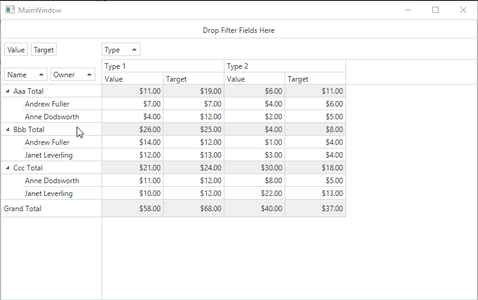

<!-- default badges list -->

<!-- default badges end -->
# How to modify a context menu for PivotGrid areas

This example shows how to modify context menu for the Field, Data and Header areas in the PivotGridControl.

**Field area** context menu contains two new items. One command enables the end-user to exclude all fields but the one which is hovered over. Another command copies the filed name to the clipboard.

**Data area** context menu conatins a command which enables the end-user to copy cell content to the clipboard.

**Field Header** context menu is modified to remove a command which reorders fields.

**Headers Area** context menu is modified to remove all built-in commands and add a drop-down menu with a single item which enables the end-user to show/hide column grand totals.

API in this example:

* [PivotGridControl.FieldValueMenuCustomizations](https://docs.devexpress.com/WPF/DevExpress.Xpf.PivotGrid.PivotGridControl.FieldValueMenuCustomizations) property
* [PivotGridControl.CellMenuCustomizations](https://docs.devexpress.com/WPF/DevExpress.Xpf.PivotGrid.PivotGridControl.CellMenuCustomizations) property
* [PivotGridControl.HeaderMenuCustomizations ](https://docs.devexpress.com/WPF/DevExpress.Xpf.PivotGrid.PivotGridControl.HeaderMenuCustomizations) property
* [PivotGridControl.HeaderAreaMenuCustomizations ](https://docs.devexpress.com/WPF/DevExpress.Xpf.PivotGrid.PivotGridControl.HeaderAreaMenuCustomizations) property
* [PivotGridControl.GridMenu](https://docs.devexpress.com/WPF/DevExpress.Xpf.PivotGrid.PivotGridControl.GridMenu) property
* [PivotGridFieldValueMenuInfo](https://docs.devexpress.com/WPF/DevExpress.Xpf.PivotGrid.PivotGridFieldValueMenuInfo) class
* [FieldValueElementData](https://docs.devexpress.com/WPF/DevExpress.Xpf.PivotGrid.FieldValueElementData) class
* [CellElementData](https://docs.devexpress.com/WPF/DevExpress.Xpf.PivotGrid.CellElementData) class
* [PivotGridField](https://docs.devexpress.com/WPF/DevExpress.Xpf.PivotGrid.PivotGridField) class
* [PivotGridField.FilterValues](https://docs.devexpress.com/WPF/DevExpress.Xpf.PivotGrid.PivotGridField.FilterValues) property
